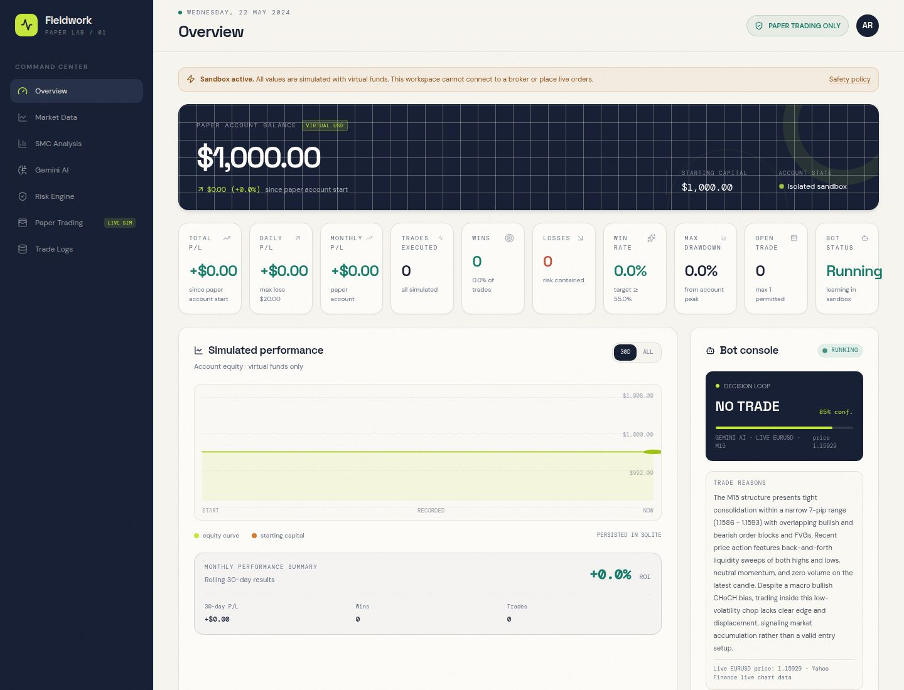

# Paper Trading Bot Dashboard (TradeLocker)

A paper-trading bot with a web dashboard. A Python analysis stack (Smart Money
Concepts detectors, risk engine, market data, SQLite persistence) produces trade
decisions against a TradeLocker demo account, and an Express + React dashboard
exposes the state, history and controls.



## Repository layout

```text
index.js            Production entrypoint: builds the frontend if needed,
                    bundles the API server and starts it
server/             Express 5 API (routes: health, trading) + scheduler, logger
src/                React 19 dashboard (Vite, Tailwind v4, shadcn-style UI)
analysis_engine/    SMC detectors, engine and data models (Python)
tests/              Python test suite
public/             Static assets served as-is (favicon, robots.txt)
screenshots/        Dashboard reference screenshot
market_data.py      Candle/price retrieval
risk_engine.py      Position sizing and risk rules
trading_bot_db.py   SQLite persistence for trades and bot state
tradelocker_client.py / tradelocker_state.py
                    TradeLocker REST client and session/account state
economic_calendar.py  Economic-event filter
run_smc_demo.py     Local demo run of the analysis engine
```

## Requirements

- Node.js 20+
- Python 3.11+ (standard library only — see `requirements.txt`)

## Getting started

```bash
npm install
cp .env.example .env   # then fill in real values
npm run dev            # Vite dev server for the dashboard
npm run dev:server     # API server on PORT (default 5000)
```

Type checks and production build:

```bash
npm run typecheck
npm run build
```

Python tests:

```bash
python3 -m unittest discover -s tests -v
```

## Environment variables

Copy `.env.example` to `.env` and fill it in. Never commit real credentials.

| Variable | Purpose |
| --- | --- |
| `TRADELOCKER_EMAIL` / `TRADELOCKER_PASSWORD` | TradeLocker account login |
| `TRADELOCKER_SERVER` / `TRADELOCKER_ACC_ID` | Server name and account id |
| `TRADELOCKER_URL` | TradeLocker backend API base URL |
| `GEMINI_API_KEY` | Primary AI decision provider |
| `GROQ_API_KEY` | Fallback AI providers (gpt-oss-120b, then qwen3) |
| `PORT` | Port the server listens on (default `5000`) |

## Deployment

Any Node host that can run a container or `npm run build && npm start` works.

```bash
docker build -t paper-trading-dashboard .
docker run -p 3000:3000 --env-file .env paper-trading-dashboard
```

`index.js` builds the frontend on first boot if `dist/` is missing, bundles
`server/index.ts` with esbuild, and serves the API plus the built dashboard from
the same port.

Runtime state (`trading_bot.db`, caches, `.runtime/`, `dist/`) is generated on
the server and intentionally git-ignored so a deploy can never overwrite live
trade history.
